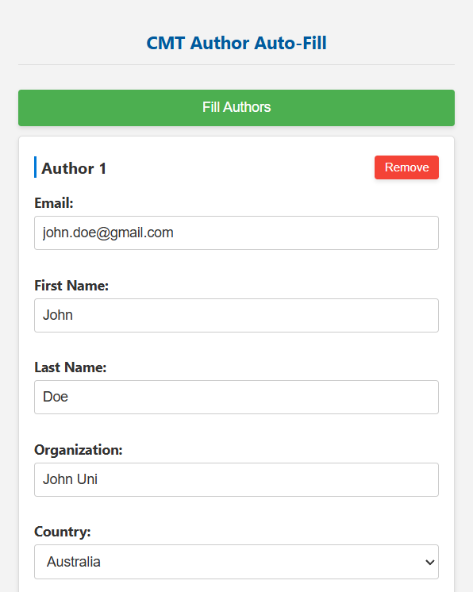
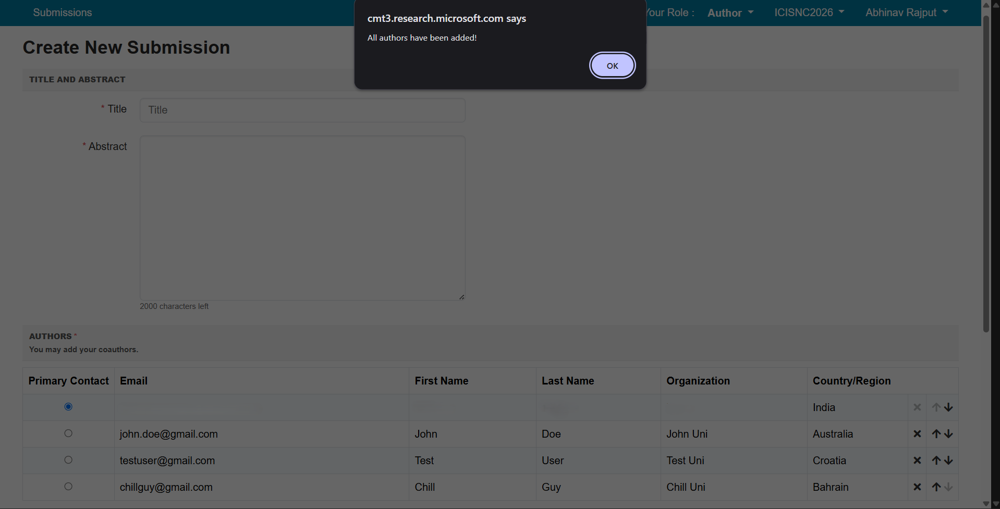

# CMT Author Auto-Fill Chrome Extension


A Chrome extension that automates the process of filling author details in the Microsoft Conference Management Toolkit (CMT). This tool allows users to save, load, and auto-fill information (Email, First Name, Last Name, Organization, and Country) for a large number of authors into the CMT form.

---

## **Features**

- **Save Author Details**: Store the details for a large number of authors for quick reuse.
- **Load Author Details**: Load saved author information into the extension.
- **Auto-Fill Form**: Automatically fill the author details sequentially in the CMT form with a single click.
- **Modern UI**: A user-friendly and responsive popup interface.

---

## **Screenshots**

### **Extension Popup Interface**

This is the popup interface where users can input author details and initiate the auto-fill process.

<div style="text-align: center;">
    
</div>


### **CMT Auto-Fill in Action**

This screenshot shows the auto-filled author details in the CMT submission form after using the extension.



---

## **Installation**

1. **Clone or Download** the repository to your local machine:

   ```bash
   git clone https://github.com/arya2004/cmt-autofill.git
   ```

2. **Open Chrome** and navigate to:

   ```
   chrome://extensions
   ```

3. **Enable Developer Mode**:
   - Toggle the developer mode switch at the top-right corner.

4. **Load the Extension**:
   - Click on the "Load unpacked" button.
   - Select the folder where the extension files are located.

5. The extension will now be visible in your Chrome toolbar.

---

## **Usage**

### **Step 1: Save Author Details**
- Click the extension icon to open the popup.
- Fill in the author details (Email, First Name, Last Name, Organization, and Country).
- Click the **Save Authors** button to store the information.

### **Step 2: Load Saved Details**
- If you've saved author details before, click the **Load Authors** button to populate the fields with saved data.

### **Step 3: Auto-Fill Form**
- Navigate to the CMT submission page.
- Click the **Auto-Fill Authors** button in the extension popup.
- The extension will sequentially:
  - Click the "Add Author" button.
  - Fill the details for each author.
  - Submit the form for each author.

---

## **Supported Fields**

Each author includes the following details:
- **Email**
- **First Name**
- **Last Name**
- **Organization**
- **Country**

---

## **Contributing**
We appreciate any contribution to enhance this project! If you're reporting a bug, proposing a new feature, or enhancing the documentation, your assistance is valued.

### **Getting Started Locally**

1. **Fork** the repository and then **clone** it to your local machine:
   
   ```bash
    git clone https://github.com/arya2004/cmt-autofill.git
    cd cmt-autofill
    ```
3. Install any dependencies if required (not applicable for this project yet).
4. **Load the Extension in Chrome**:
    - Navigate to `chrome://extensions/`.
    - Enable **Developer Mode** (top right corner).
    - Click **Load unpacked**
    - Select the root folder of the project you just cloned
5. Make your changes, save the files, and refresh the extension in Chrome to see your updates in action.

### **Finding your First Issue**
A great way to start is by looking for beginner-friendly issues. Check our issues tab for anything with the [**good first issue**](https://github.com/arya2004/cmt-autofill/labels/good%20first%20issue) label.
These issues are specifically curated to be approachable and often include guidance or extra context to help you get started.

For detailed instructions on how to get started, please see our [**Contributing Guide**](./CONTRIBUTING.md).

## **License**

This project is licensed under the [CC BY-NC-ND 4.0](LICENSE).

---

